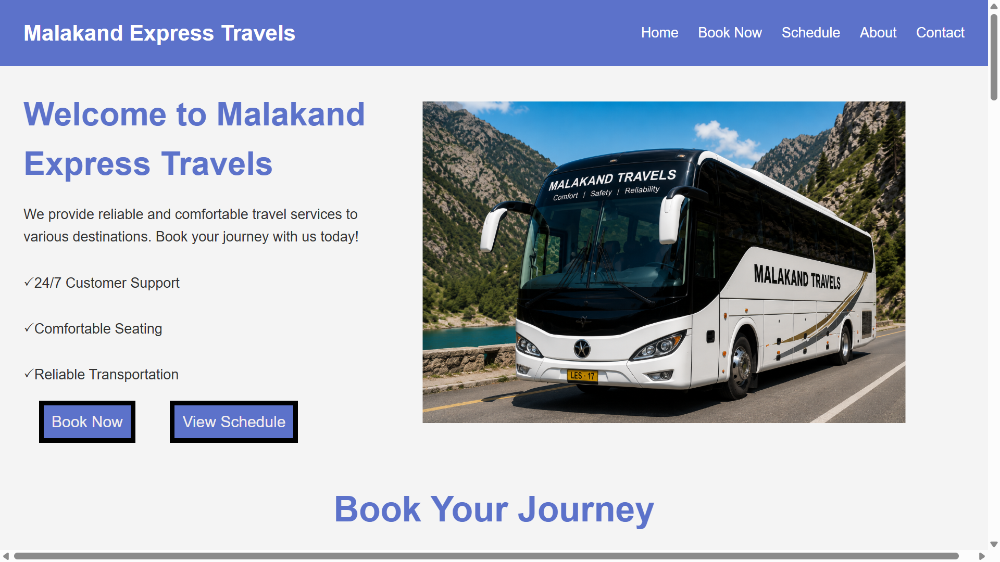

# 🚌 Malakand Express Travels

A modern and responsive travel booking website built using **HTML**, **CSS**, and **JavaScript**.

This project was created to practice front-end web development by designing a complete travel agency website with a clean user interface, responsive layout, and interactive features.

---

## 📸 Project Preview

> Home page


## ✨ Features

- 📱 Fully Responsive Design
- 🍔 Mobile Hamburger Navigation
- 🎨 Modern User Interface
- 🚌 Bus Schedule Section
- 🖼️ Image Gallery
- ⭐ Customer Reviews
- 👥 About Us Section
- 📞 Contact Section
- 📝 Booking Form
- ✅ JavaScript Form Validation
- ✨ Smooth Scrolling Navigation

---

## 🛠️ Technologies Used

- HTML5
- CSS3
- JavaScript (Vanilla JS)

---

## 📂 Project Structure

malakand-express-travels/
│
├── css/
│   └── style.css
│
├── html/
│   ├── index.html
│   ├── bus_img.png
│   ├── front_view.png
│   ├── gallery1.jpg
│   ├── gallery2.jpg
│   ├── gallery3.jpg
│   └── ... (other website images)
│
├── javascript/
│   └── script.js
│
├── images/
│   └── homepage.png
│
└── README.md

## 🚀 How to Run

1. Clone the repository

```bash
git clone https://github.com/mujahidullah712/malakand-express-travels.git
```

2. Open the project folder.

3. Open `html/index.html` in your browser.

---

## 📚 What I Learned

Through this project, I improved my understanding of:

- Semantic HTML
- CSS Flexbox
- CSS Grid
- Responsive Web Design
- Media Queries
- JavaScript DOM Manipulation
- Event Listeners
- Form Validation
- Git & GitHub

---

## 🎯 Future Improvements

- Online ticket booking backend
- Database integration
- User authentication
- Payment gateway
- Live bus tracking
- Admin dashboard
- Dark mode

---

## 👨‍💻 Author

**Mujahid Ullah**

GitHub:
https://github.com/mujahidullah712

---

## 📄 License

This project is created for learning and portfolio purposes.